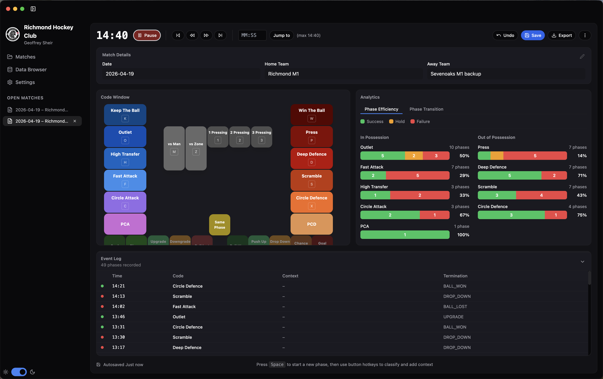
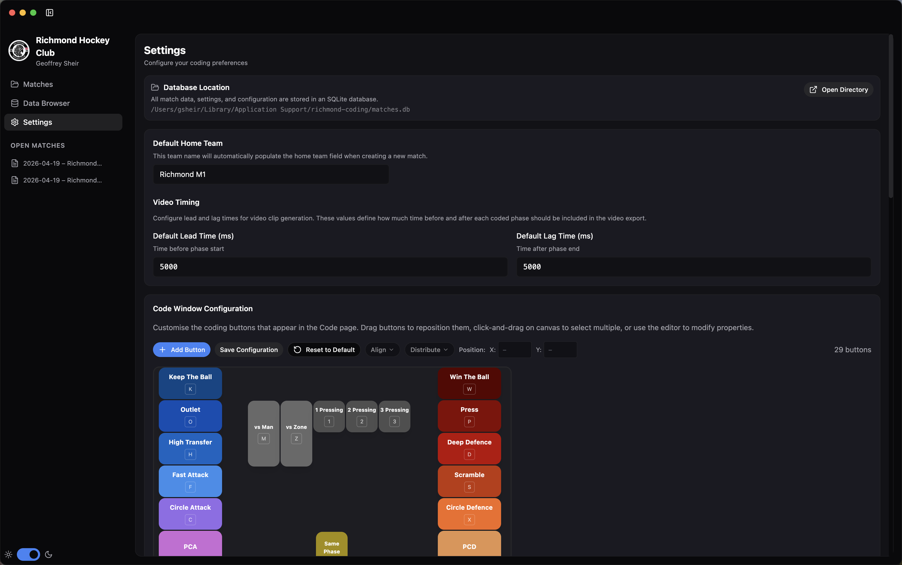

# Richmond Hockey Coding App

This is a bespoke sports coding app for live or retrospective event data collection. I can't pay for Sportscode so I'm building my own. 

## Running the App

### Development
```bash
npm run dev:electron
```

This starts the Vite dev server and Electron in development mode with hot reload.

### Build Native App
```bash
npm run build:mac
```

This creates a `.dmg` installer in the `release/` directory.


## Configuring the Code Window

The app provides a visual configuration editor in the Settings page where you can:
- Add, edit, and delete coding buttons
- Drag buttons to reposition them
- Customise colours, styling, and hotkeys
- Configure lead/lag times for video clips

Configuration is stored in the SQLite database at:
`~/Library/Application Support/Richmond Hockey Club/matches.db`



